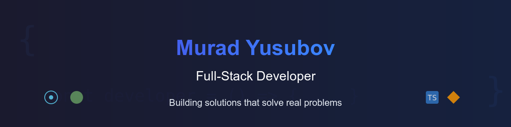

# Murad Yusubov | Full-Stack Developer

👋 Hello! I'm Murad, a self-taught Full-Stack Developer from Baku with 3 years of experience building web applications. I specialize in JavaScript, TypeScript, and modern frameworks like React and Next.js.

🔭 Currently focused on Student Budget Buddy, a finance tracking app for students, and exploring AI/ML integration in my projects.

🚀 Passionate about creating practical solutions and continuously expanding my knowledge in web technologies and cloud services.

## 🚀 Featured Projects

### Job Hub | Job Application Tracking App

A centralized application for tracking job applications, featuring authentication, manual job adding, and integrated job board with API integrations.

[View Project](https://github.com/Biolater/jobhub) | [Live Demo](https://newmain.d2uhr2kwe1sd1q.amplifyapp.com/home-page)

### Student Budget Buddy | Finance Management for Students

A comprehensive budget tracking application for students with expense tracking, budget creation, visualization charts, and planned AI integration for financial insights.

[View Project](https://github.com/Biolater/Student-Budget-Buddy) | [Live Demo](https://student-bugdet-buddy-lyje.vercel.app)

## 💻 Tech Stack

### Frontend

### Backend

### AI / Data Libraries

### Tools

## 📊 GitHub Stats:

<picture>
  <source media="prefers-color-scheme: dark" srcset="https://raw.githubusercontent.com/biolater/biolater/output/github-snake-dark.svg" />
  <source media="prefers-color-scheme: light" srcset="https://raw.githubusercontent.com/biolater/biolater/output/github-snake.svg" />
  
</picture>

## 🤝 Let's Connect!

I'm always open to interesting projects and collaboration opportunities.

📫 Email: yusifovmurad1@gmail.com
